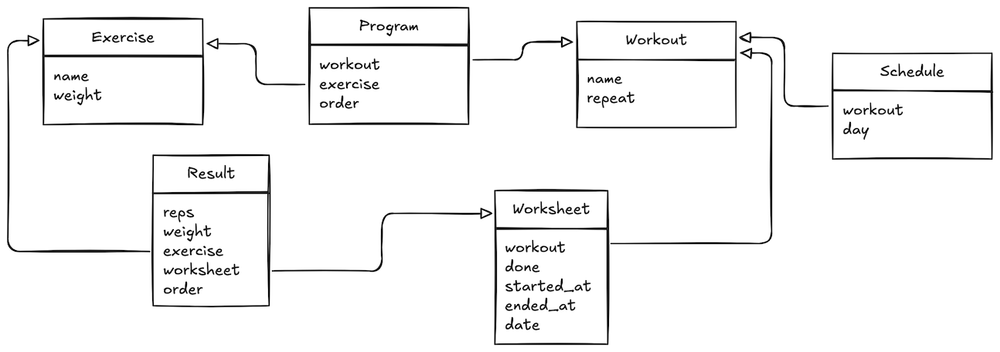

<h1>A small Django application to track workout sessions</h1>

* [Overview](#overview)
  * [Models](#models)
* [Installation](#installation)
  * [1. Clone the repository](#1-clone-the-repository)
  * [2. Install requirements in a virtual environment](#2-install-requirements-in-a-virtual-environment)
  * [3. (Optional) Database setup](#3-optional-database-setup)
  * [4. Apply the migrations and the base data set](#4-apply-the-migrations-and-the-base-data-set)
  * [5. (Optional) Edit the current user's timezone](#5-optional-edit-the-current-users-timezone)
  * [6. (Optional) Create the super user account](#6-optional-create-the-super-user-account)
  * [7. Run the development server](#7-run-the-development-server)
* [Usage](#usage)
* [Notes](#notes)
  * [No user account needed](#no-user-account-needed)
  * [CSS Grid](#css-grid)
  * [HTMX](#htmx)

# Overview

This is an app built to tackle two issues at the same time:

1. Replace old, antiquated spreadsheets used to track workout sessions
2. Learn Django development

The first one can be considered done, and the second is still in progress (as
learning often is).

## Models

The app consists of 4 main and 2 intermediary models. You can deploy the
collapsed element below to get a description of those in about a thousand
words.

<details>
<summary>Models relationship</summary>


`Workout`, `Exercise`, and `Schedule` should be self-explanatory.

A `Program` is simply the list of `Exercise`s of a `Workout`, in a specific
order.

A `Worksheet` is an instance of a given `Workout`, on a given date.

Finally, a `Result` is the actual data associated with an `Exercise` and a
specific `Worksheet`.
</details>

# Installation

## 1. Clone the repository
```sh
$ git clone git@gitlab.com:laurentbardin/workout_tracker
```

## 2. Install requirements in a virtual environment

Using `pip`:
```sh
$ cd workout_tracker
$ python -mvenv .venv
$ . .venv/bin/activate
$ pip install -r requirements.txt
```

*Or* using `uv`:
```sh
$ cd workout_tracker
$ uv sync
$ . .venv/bin/activate
```

## 3. (Optional) Database setup

By default, the app uses SQLite for a quicker setup, but is perfectly
compatible with PostgreSQL (the previous step installed the `psycopg` library).
Simply edit the `DATABASES` entry to your liking in `settings.py`.

*Note*: when using PostgreSQL, the server's timezone should be set to
`Etc/UTC`, just like the app (`TIME_ZONE` in `settings.py`).

## 4. Apply the migrations and the base data set
```sh
$ python manage.py migrate
$ python manage.py loaddata --app worksheet fixtures/worksheet.json
```
This step adds 3 workouts and their exercises, as well as a basic schedule
(Monday to Saturday).

## 5. (Optional) Edit the current user's timezone

Because this app was thought of as single-user but deals with timezone-aware
datetimes, I added an app setting to simulate a user setting.

In `settings.py`, edit `USER_TIME_ZONE` to match the one of your current
geographical location. The default is `Europe/Paris`.

## 6. (Optional) Create the super user account
```sh
$ python manage.py createsuperuser
```
Can be done later, if you want to take a look at the admin area.

## 7. Run the development server
```sh
$ python manage.py runserver
```
Open a browser to test the app: [http://localhost:8000](http://localhost:8000)

# Usage

The homepage displays a calendar view of the current month, with the current
day highlighted. If a workout is scheduled for today, clicking the button will
create the needed worksheet and (empty) results, and redirect you to the
worksheet page where you can start inserting data (and working out).

When done, you simply close the worksheet with the button at the bottom of the
page.

On the calendar view, past workouts are clickable if done.

# Notes

## No user account needed

This was built to fill a personnal need, so I didn't bother using Django's
builtin user management for that reason.

## CSS Grid

Even though tables are a perfect use case for the way worksheets are presented,
some issues arose when adding the form to post the data using HTMX. As I wanted
to improve my knowledge of CSS Grid, this was a good opportunity to do so.

## HTMX

Another piece of technology I wanted to earn some experience with (there's a
pattern here), and that felt perfect for my needs instead of a full-blown
frontend framework.
